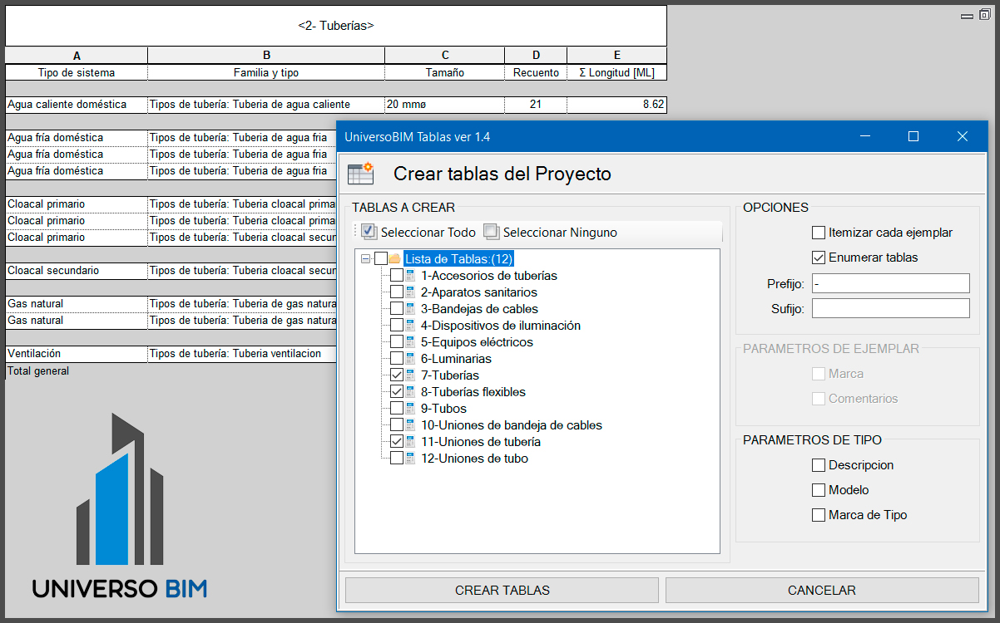

# UniversoBIM Tablas

Herramientas para trabajar con Tablas en Revit. 

Creación automática de tablas y exportación a Excel

## Requisitos
* Autodesk Revit 2017
* Autodesk Revit 2018
* Autodesk Revit 2019
* Autodesk Revit 2020
* Autodesk Revit 2021

## Instalador
Puedes descargar el instalador para windows desde este link
* https://sourceforge.net/projects/universo-bim-tablas/files/latest/download
